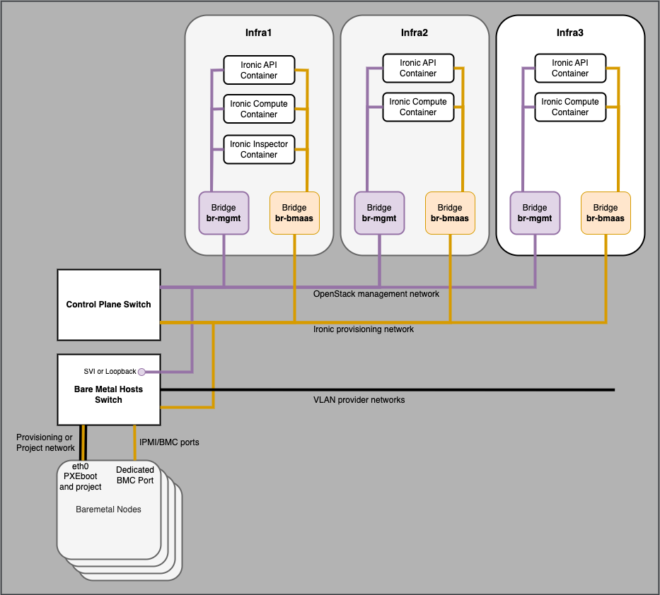

===================================
Example LXC based Ironic deployment
===================================

This section describes a specific deployment of Ironic using
OpenStack-Ansible. A number of design choices are made which
illustrate how to configure the Ironic service for a specific
set of requirements.

Deployment design decisions:

* LXC containers are used in the openstack control plane
* A single ``bmaas`` network is used for Ironic provisioning,
  cleaning and inspection
* The ``bmaas`` network is not routable to any other networks
  nor to the internal VIP
* Multitenancy is used with Ironic servers attached to project
  networks
* networking-generic-switch will be used to control network devices
  to achieve multitenancy
* Cisco NXOS switches
* The deployment uses VXLAN project networks

A number of these design decisions are opinionated and could be
changed, e.g. allowing the ``bmaas`` network to be routed to
other networks including the internal VIP would result in some
simplification.

This example is illustrative of a specific set of deployment
requirements but is not intended to be followed rigidly. It
demonstrates some of the capabilities of Ironic and
OpenStack-Ansible and how to approach most parts of a practical
deployment of Ironic at small to modest scales.

.. warning::
  Consideration should be given to the security of IPMI or other
  out-of-band interfaces which are notoriously buggy and often
  have vendor specific in-band tools which allow the BMC and its
  firmware to be manipulated from userspace. Understand the risks
  of allowing IPMI/BMC interfaces to share a physical interface
  with onboard ethernet ports, this feature will allow full access
  to the management interface of a deployed Ironic node. For high
  security environments or where the users are untrusted consult
  your hardware vendor for appropriate hardening steps.

BMaaS network address plan
~~~~~~~~~~~~~~~~~~~~~~~~~~

In this example the subnet for the ``bmaas`` network is 10.88.104.0/24.
The size of the subnet determines the maximum number of nodes
in the Ironic deployment.

===================== ==============================================
Address               Purpose
===================== ==============================================
10.88.104.0 to .10    Reserve for potential physical routers / SVI
10.88.104.11 to .29   Control plane Ironic container interfaces
10.88.104.64 to .95   Neutron DHCP allocation pool in Ironic_Network
10.88.104.96 to .127  Ironic Inspector DHCP pool range
10.88.104.128 to .254 Static IPs manually assigned to IPMI/iDRAC
===================== ==============================================

In this deployment the ``bmaas`` network combines several functions
for simplicity. It would be possible to use separate networks for
inspection, cleaning and provisioning but that is beyond the scope
of this example.

The subnet is divided into several address ranges, a reservation for
future interfaces on physical routers, or a gateway address if the
subnet is to be made routable in the future. A small number of addresses
are then reserved for the ``bmaas`` network to connect to the Ironic
containers in the control plane, and the remainder of the addresses
are shared between a neutron network for provisioning, a range for
Ironic Inspector to allocate with DHCP and finally a block of
addresses for the IPMI (or other protocol) management ports
of the Ironic nodes.

.. note::
  This example will use VLAN ID 3003 for the ``bmaas`` network but
  any available VLAN ID could be used.

.. warning::
  This example collapses the Ironic IPMI, provisioning, cleaning
  and inspection networks into the same subnet. It is possible
  to make these be separate from each other by creating a network
  for each different function and updating the container networks
  and Ironic service configuration suitably. In particular it should
  be understood that the nodes are "untrusted" during the cleaning
  phase and will be in an arbitrary state as left by the previous
  user.

IPMI Interfaces
~~~~~~~~~~~~~~~

When configuring IPMI interfaces for Ironic nodes, the following steps
are recommended:

* Use static IP allocations for the IPMI interfaces, unless there is
  already a very reliable means of allocating addresses with DHCP. The
  Ironic team do not consider the Neutron DHCP agent to be suitable
  for assigning addresses to the IPMI interfaces.

* Use dedicated IPMI ports on Ironic nodes especially if multitenancy
  is required. A node with a shared onboard ethernet/IPMI port will have
  that port moved into the tenant network when deployment is complete
  and the Ironic control plane will no longer be able to communicate with
  the management interface of the node.

Maximum size of the deployment
~~~~~~~~~~~~~~~~~~~~~~~~~~~~~~

The maximum size of this Ironic deployment is limited by the
address alloction in the ``bmaas`` network. In this example there can
be a maximum of 127 server BMC interfaces in the range 10.88.104.128/25.

The maxiumum number of servers that can be simultanously provisioned is
determined by the address allocation to the Neutron DHCP pool.

The maximum number of servers that can be simultanously inspected is
determined by the address allocation to the Ironic Inspector DHCP pool.

To increase the size of the deployment, the size of the ``bmaas``
subnet should be increased and the addresses allocated to meet the
number of required nodes and maximum number of simultaneous nodes
being provisioned and inspected.

OpenStack-Ansible configuration
~~~~~~~~~~~~~~~~~~~~~~~~~~~~~~~

Once the address plan has been decided, the OpenStack-Ansible configuration
can be updated to match.

The existing ``cidr_networks`` and ``used_ips`` sections in
``/etc/openstack_deploy/openstack_user_config.yml`` must have extra
entries to describe the network range available for the Ansible inventory
to assign to Ironic control plane containers, in this example all addresses
in the ``bmaas`` network are marked as used except the range 10.88.104.11
to 10.88.104.29.

An additional network is defined in the ``provider_networks`` list which
represents the connection between the bridge ``br-bmaas`` on the
controller and ``eth15`` inside the ironic service containers.

The ``bmaas`` network must be extended from the control plane hosts
to the switch ports connected to the Ironic node IPMI interfaces,
and also to switch ports connected to the interfaces on the Ironic
nodes that will be used for PXEboot. This will typically be a VLAN
allocated specifically for Ironic provisioning.

The hosts for the Ironic control plane containers are assigned.

.. note::

  It is the responsibility of the deployer to create br-bmaas
  on the controller nodes and ensure that it is connected to
  the correct VLAN ID for the ``bmaas`` network. Configuration of
  host networking is outside the scope of OpenStack-Ansible.

.. note::

  The ``range`` key in the provider network definition is not used
  but its useful as an reminder in the config file of the VLAN ID.

.. code-block:: yaml

  cidr_networks:
    <existing entries>
    bmaas:     10.88.104.0/24        # for containers on the bmaas network

  used_ips:
    <existing entries>
    # bmaas ips
    - "10.88.104.0,10.88.104.10"     # reserve for routers or other infrastructure
    - "10.88.104.30,10.88.104.255"   # reserve for ironic IPMI and provisioning

  provider_networks:
    <existing entries>
    # Network definition to connect Ironic LXC containers to the bmaas network
    # on the infra hosts
    - network:
        net_name: physnet_neutron
        container_type: "veth"
        container_bridge: "br-bmaas"
        container_interface: "eth15"
        ip_from_q: bmaas
        type: "vlan"
        range: "3003:3003"
        group_binds:
          - ironic_api_container
          - ironic_compute_container
          - ironic_inspector_container

  # ironic API and conductor
  ironic-infra_hosts:
    infra1: *_infra1_
    infra2: *_infra2_
    infra3: *_infra3_

  # nova used by ironic for machine state management
  ironic-compute_hosts:
    infra1: *_infra1_
    infra2: *_infra2_
    infra3: *_infra3_

  # Ironic-inspector can only support a single instance at the moment
  # High availability for ironic-inspector is not yet implemented
  ironic-inspector_hosts:
    infra1: *_infra1_

.. note::
  This example uses YAML Anchors to simplify ``openstack_user_config.yml``
  allowing the IP addresses of the infra nodes to be defined only once.
  See https://yaml.org/spec/1.2.2/#alias-nodes.

Create the Neutron configuration
~~~~~~~~~~~~~~~~~~~~~~~~~~~~~~~~

Enable the Neutron ``baremetal`` and ``genericswitch`` mechanism drivers
by updating ``/etc/openstack_deploy/group_vars/neutron_server.yml``

.. code-block:: yaml

  ---
  neutron_plugin_types:
    - ml2.genericswitch
    - ml2.baremetal

  # keep the ml2 drivers in this order
  # see https://storyboard.openstack.org/#!/story/2008686
  neutron_ml2_mechanism_drivers: "genericswitch,baremetal"

Configure neutron networking-generic-switch to know about the switches
that the Ironic nodes are connected to in ``/etc/openstack_deploy/user_variables.yml``.
These switches are programmed by neutron to switch the Ironic nodes between the
provisioning and project networks once deployment is complete. This is enabling
multitenancy for Ironic.

This example is for a Cisco NXOS based switch, which uses the same command
set as a Cisco IOS based switch for the functions needed by
networking-generic-switch. There is no specific ``device_type`` for NXOS.

.. note::

  A MAC address for the switch must be specified in the neutron config, but Cisco
  and some other switch vendors present a unique MAC address per port so the MAC
  address as seen from the client cannot be used to identify the switch. For IOS/NXOS
  networking-generic-switch uses the field ``switch_info`` from the Ironic node
  ``local_link_connection`` information rather than match a MAC address when
  choosing which switch to configure for a particular node.

.. code-block:: yaml

  neutron_neutron_conf_overrides:
    genericswitch:my-switch-name:            # This should match the hostname configured on the switch
      device_type: netmiko_cisco_ios         # It is really NXOS but the commands are the same
      ngs_mac_address: "cc:46:d6:64:4b:41"   # Doesn't seem to matter but is required - this is taken from an SVI on the mgmt network
      ip: "10.80.240.3"                      # An IP on the switch which has ssh access from the br-mgmt network, loopback, SVI or mgmt0 as needed
      username: "neutron"                    # The user that Neutron will SSH to the switch as
      password: "supersecret"                # The password that Neutron will use to SSH to the switch
      ##  key_file: <ssh key file>           # An SSH key may be used instead of a password
      ngs_manage_vlans: "false"              # VLANs are already provisioned on the switch so tell neutron not to create/delete VLANs

.. note::

  The configuration for networking-generic-switch is added to neturon.conf
  rather than ml2_conf_genericswitch.ini as the config needs to be read by
  both neutron-rpc-server and neutron-server. neutron-server is a uwsgi
  service in openstack-ansible so is only passed one config file,
  see https://bugs.launchpad.net/openstack-ansible/+bug/1987405

.. note::
  If there is already an override in place for this variable
  then extend the existing override rather than making a
  second one.

Configure switch to allow ssh from Neutron
~~~~~~~~~~~~~~~~~~~~~~~~~~~~~~~~~~~~~~~~~~

To achieve multitenancy, Neutron will connect to the specified switch and
configure the port for the Ironic node being provisioned to be in the
correct project VLAN once the deployment is complete. During deployment
Neutron will ensure that the node is in the ``bmaas`` provisioning
network as specified in the Ironic config.

A suitable user and credential must exist on the switch. The SSH
connection will originate from the Neutron processes running on the
OpenStack control plane, on the ``mgmt`` network. There must be an IP
route from the ``mgmt`` network to an interface on the switch which
permits SSH login. That interface could be a physical management port
(``mgmt0`` on NXOS), a loopback interface, an SVI or another interface
with an IP address. SSH communication with the switch can happen either
in-band or out-of-band depending on the requirements of the deployment.

This example config is for a ``neutron`` user using password authentication
on an NXOS switch as seen by ``show run``. The config applied on the
switch gives the ``neutron`` user access to a minimal set of commands
for configuring VLAN membership on specific ports.

To control the commands that the ``neutron`` user is allowed to issue
on the Cisco Nexus switch create a role:

.. code-block:: bash

  role name neutron-role
    rule 3 permit command configure t
    rule 2 permit read-write feature interface
    rule 1 permit read
    vlan policy deny
      permit vlan 3003-3003
      permit vlan 3100-3200
    interface policy deny
      permit interface Ethernet1/1
      permit interface Ethernet1/2
      permit interface Ethernet1/3
      permit interface Ethernet1/4
      permit interface Ethernet1/5
      permit interface Ethernet1/6
      permit interface Ethernet1/7
      permit interface Ethernet1/8

This role allows the ``neutron`` user assign a port to VLAN 3003
which is the ``bmaas`` network and is used during node provisioning.
Any project VLANS that nodes should be able to be moved into after
deployment should also be permitted, range 3100-3200 here.

The interfaces which the ``neutron`` user is permitted to modify are
listed, in this case individually but consult the switch documentation
for other options such as a regular expression.

A similar config can be made on an Arista switch, where a much more
explicit list of allowed CLI commands must be defined using regular
expressions.

.. code-block:: bash

  role neutron-role
     10 permit mode exec command configure
     20 permit mode exec command terminal width 511
     30 permit mode exec command terminal length 0
     40 permit mode exec command enable
     50 permit mode exec command copy running-config startup-config
     60 permit mode config command interface
     70 permit mode if-Et([1-9]|27|29)\/1 command switchport mode access
     80 permit mode if-Et([1-9]|27|29)\/1 command (no )*switchport access vlan (3003|3966)
     90 permit mode if-Et([1-9]|27|29)\/1 command no switchport mode trunk
     100 permit mode if-Et([1-9]|27|29)\/1 command switchport trunk allowed vlan none
     110 permit mode config command copy running-config startup-config

Create the user and password, which must match those in the
``neutron.conf / genericswitch`` config file options:

.. code-block:: bash

  username neutron password 5 <ENCRYPTED-PASSWORD-HERE> role neutron-role

Allow SSH to the switch from the expected
IP addresses, for example a pair out of band management hosts
192.168.0.100/31 and the OpenStack ``mgmt`` network 10.80.240.0/24.

.. code-block:: bash

  ip access-list ACL_ALLOW_SSH_VTY
    10 permit tcp 192.168.0.100/31 any eq 22
    20 permit tcp 10.80.240.0/22 any eq 22

  line vty
    session-limit 5
    exec-timeout 10
    access-class ACL_ALLOW_SSH_VTY in

Create the Neutron network for Ironic provisioning, cleaning and inspection
~~~~~~~~~~~~~~~~~~~~~~~~~~~~~~~~~~~~~~~~~~~~~~~~~~~~~~~~~~~~~~~~~~~~~~~~~~~

.. code-block:: bash

  openstack network create \
    --internal \
    --provider-network-type vlan \
    --provider-physical-network physnet_neutron \
    --provider-segment 3003 \
    Ironic_Network

  openstack subnet create \
    --allocation-pool 10.88.104.64-10.88.104.95 \
    --dhcp \
    --subnet-range 10.88.104.0/24
    --gateway none
    Ironic_Subnet

Create the Ironic configuration
~~~~~~~~~~~~~~~~~~~~~~~~~~~~~~~

In ``/etc/openstack_deploy/user_variables_ironic.yml``

.. code-block:: yaml

  ## IRONIC ##

  ironic_ipxe_enabled: yes                  # use HTTP image download from the ironic conductor container
  ironic_enable_web_server_for_images: yes  # use same web server to cache user images

  # Ensure values used during PXEboot refer directly to the correct interface on Ironic API container
  # instead of the internal VIP
  ironic_http_url: "{{ ironic_ipxe_proto }}://{{ container_networks['bmaas_address']['address'] }}:{{ ironic_ipxe_port }}"
  ironic_tftp_server_address: "{{ container_networks['bmaas_address']['address'] }}"

  # Enable ironic drivers
  ironic_drivers_enabled:     # Use PXE boot and IPMItool
    - agent_ipmitool
    - pxe_ipmitool
    - pxe_drac                # enables drivers for Dell iDrac interface

  # Configure Ironic to use Neutron networking
  ironic_enabled_network_interfaces_list: "noop,neutron"
  ironic_default_network_interface: neutron

  # Enable the default set of cleaning steps
  ironic_automated_clean: yes

  # Configure the neutron networks that Ironc should use
  ironic_neutron_provisioning_network_name: "Ironic_Network"
  ironic_neutron_cleaning_network_name:     "Ironic_Network"
  ironic_neutron_inspection_network_name:   "Ironic_Network"

  # Ensure ironic API (using uwsgi) listens on br-bmaas for agent callbacks
  # as well as the mgmt interface for the loadbalancer
  ironic_uwsgi_bind_address: 0.0.0.0

  # Add ipa-insecure=1 to kernel parameters
  # Needed when ironic endpoint is available over https with self-signed cert.
  ironic_kernel_append_params: "ipa-debug=1 systemd.journald.forward_to_console=yes ipa-insecure=1"

  # INI file overrides
  ironic_ironic_conf_overrides:
    # Disable full device erasure (slow) and just metadata erasure, and replace with "Express erasure"
    # which tries to use firmware secure-erase command, but if that fails, reverts to metadata erasure.
    # See: https://docs.openstack.org/ironic/latest/admin/cleaning.html#storage-cleaning-options
    deploy:
      erase_devices_priority: 0
      erase_devices_metadata_priority: 0
    conductor:
      clean_step_priority_override: "deploy.erase_devices_express:5"

    # Direct IPA to callback directly to deploying ironic container (via BMAAS network)
    # instead of going via HAProxy on mgmt network. Only applies when bmaas network is isolated.
    service_catalog:
      endpoint_override: "http://{{ container_networks['bmaas_address']['address'] }}:6385"

    # Enable ipmitool's Serial-over-LAN terminal console for baremetal nodes
    DEFAULT:
      enabled_console_interfaces: "ipmitool-socat,no-console"

  ## IRONIC INSPECTOR ##

  # Direct Inspector to callback directly to deploying ironic container (via BMAAS network)
  # instead of going via HAProxy on mgmt network. Only applies when bmaas network is isolated.
  ironic_inspector_callback_url: "{{ ironic_inspector_service_internaluri_proto }}://{{ container_networks['bmaas_address']['address'] }}:{{ ironic_inspector_service_port }}/v1/continue"

  # Add ipa-insecure=1 to kernel parameters
  # Needed when inspector is available over https with self-signed cert.
  ironic_inspector_extra_callback_parameters: "ipa-collect-lldp=1 ipa-insecure=1"

  # Ensure inspector API (using uwsgi) listens on br-bmaas for agent callbacks
  # as well as the mgmt interface for the loadbalancer
  ironic_inspector_service_address: "0.0.0.0"

  # dnsmasq/dhcp information for inspector
  ironic_inspector_dhcp_pool_range: 10.88.104.96 10.88.104.127
  ironic_inspector_dhcp_subnet: 10.88.104.0/24
  ironic_inspector_dhcp_subnet_mask: 255.255.255.0
  ironic_inspector_dhcp_enable_gateway: false
  ironic_inspector_dhcp_enable_nameservers: false

  ironic_inspector_dhcp_interface: eth15   # connected to br-bmaas on the host

Deploy Neutron changes
~~~~~~~~~~~~~~~~~~~~~~

.. code-block:: bash

  openstack-ansible playbooks/os-neutron-install.yml

Deploy the ironic-specific nova services
~~~~~~~~~~~~~~~~~~~~~~~~~~~~~~~~~~~~~~~~

This deploys nova compute and nova console services
to the ironic compute containers.

.. code-block::

  playbooks/os-nova-install.yml --limit ironic_all

Deploy changes to HAProxy
~~~~~~~~~~~~~~~~~~~~~~~~~

This will bring up the required Ironic, Inspector, and console
endpoints.

.. code-block:: bash

  openstack-ansible playbooks/haproxy-install.yml --tags haproxy_server-config

Deploy the Ironic and Inspector services
~~~~~~~~~~~~~~~~~~~~~~~~~~~~~~~~~~~~~~~~

.. code-block::

  openstack-ansible playbooks/os-ironic-install.yml

Deploy the Horizon dashbaords for Ironic
~~~~~~~~~~~~~~~~~~~~~~~~~~~~~~~~~~~~~~~~

.. code-block:: bash

  openstack-ansible playbooks/os-horizon-install.yml

Using Ironic
~~~~~~~~~~~~

Please refer to the general instructions in the Configuring Ironic
section of this documentation.

VXLAN project networks
~~~~~~~~~~~~~~~~~~~~~~

In this example Ironic multitenancy is implemented using
VLANs. In an OpenStack deployment where project networks
are implemented using an overlay such as VXLAN, it will not
be possible to attach Ironic nodes directly to these networks.
In addition, it is not possible for an end user to request that
the underlying implementation is VLAN when creating a project
network.

In a cloud using overlay project networks it will be
necessary for the cloud administrator to create VLAN provider
networks for users to attach Ironic nodes to and to share these
into individual projects using Neutron RBAC.
